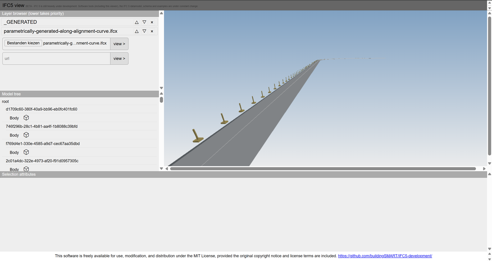

IFC5 parametrics investigation
==============================

This is an investigation towards enriching IFC5 datasets with procedural functions in javascript.

**NB1** This proposal currently has no official status in any community whatsoever, this is purely out of academic interest.

**NB2** Due to lock in into a specific language, heaviness of embedding a JS runtime, additional complexity, this is envisioned strictly as an optional module on top of IFC5.

Try live at: https://aothms.github.io/parametric-ifc5-proposal/viewer/

Model: https://raw.githubusercontent.com/aothms/parametric-ifc5-proposal/refs/heads/parametrics-proposal/examples/parametrics/parametrically-generated-along-alignment-curve.ifcx

## Rationale

### Why Javascript

- Ecmascript interpreters can be relatively easily embedded into host applications
- Excellent developer familiarity and tooling
- Matches the IFC5 underlying data serialization model (JSON)
- We would all love more declarative approaches, but express' function language is also imperative; making porting the logic from ifc4.x versions more straightforward

### Why IFC5

- IFC5 prioritizes explicit data for robustness, but additional intelligence might still be desirable as supplementary streams of information in certain workflows
- The collaborative model of composing multiple layers allows for the scripts to operate on data from other layers and therefore from other stakeholders
- IFC5 has a very clean data model of trees post-composition. How to reason about insertion and replacement is self-evident as opposed to the complex graphs in IFC4. THe bottom-to-top execution order makes the interaction between multiple scripts in the tree also self-evident.
- The ECS-inspired extensibility enables the model to be visualized in any IFC5 viewer; except for the parametric behaviour which is just rendered as normal attribute data. 

## Envisioned application areas:

- **Generation of data** New nodes could be inserted into the graph or new attributes can be derived from source data
- **Validation of data** Source data can be validated by a function
- **Migration of data** Migration rules can be encoded in a schema for compatibility between schema editions

## Function distribution

Functions could be distributed in:

- End-user models for encoding parametric behaviour of elements
- bSDD like registries
- Official schemas for constraints and migration rules
- IDS? Based on IDS applicability the requirement could be encoded in a JS function with a post-composition subtree of the model as context
- NPM-like mechanism to distribute a 'standard library' of functions to tap into.

## Example

Based on a simplified horizontal alignment (only linear and composite curve), an element is positioned multiple times along the alignment curve in a similar fashion as IFC4.3 linear placement.



Parametric behaviour is encoded using standard schema constructs as a sub-primitive of the element it operates on. The first object registers the path as an object containing parametric code (`parametrics::class` = `CodeObject`) and then under the CodeObject namespace sets the function code and expected state.

- `COMPOSED_LOCAL_PRIMITIVE` the entire subtree at the code object parent is passed
- `COMPOSED_FULL_TREE` the entire model tree is provided; needed to resolve the reference to the repeated element
- `UNCOMPOSED_LAYER` the function outputs a new IFCx layer that is to be appended to the layerstack. In the future it would likely be possible to save such computed layers to disk in order to "bake" them into explicit data.

The second object defines contextual variables for that are read by the script. Because these are regular ifcx attributes and because the script operates on post-composition data, these attributes can come from other layers as well and therefore authoring tools can exchange procedural logic where end-users can supply their inputs in their own layers.

- `advanced_properties::spacing` spacing between the elements
- `advanced_properties::repeating_element` a reference to the path of the element that is to be instantiated multiple times along the alignment curve

```json
{
    "path": "2c7c16de-dd62-46ab-9e6a-6d903fc48467",
    "attributes": {
        "parametrics::class": {
            "code": "CodeObject",
            "uri": "-"
        },
        "parametrics::CodeObject": {
            "name": "RepeatElements",
            "code": "function RepeatElements(t,e,n){const a=(t,e,n=void 0)=>t&&t.attributes&&e in t.attributes?t.attributes[e]:n,r=t=>e=>a(e,'bsi::ifc::class::code')===t;function o(t,e,n,a){const r=Math.cos(a),o=Math.sin(a);return[[r,o,0,0],[-o,r,0,0],[0,0,1,0],[t,e,n,1]]}const i=a(t,'advanced_properties::spacing',1),s=a(t,'advanced_properties::repeating_element::ref',void 0),...",
            "input": [
                "COMPOSED_LOCAL_PRIMITIVE",
                "COMPOSED_FULL_TREE"
            ],
            "output": [
                "UNCOMPOSED_LAYER"
            ]
        }
    }
},
{
    "path": "2c7c16de-dd62-46ab-9e6a-6d903fc48467",
    "attributes": {
        "advanced_properties::spacing": 5.0,
        "advanced_properties::repeating_element": {
            "ref": "a6601de8-4da6-4df9-ac6d-d9bab47195ba/Bar"
        }
    }
}
```

The function is minified so that it fits in a single line string (`npx terser fn.js -o fnm.js -c -m -f quote_style=1`).

```js
function RepeatElements(codeObject, localPrim, fullTree) {

    const getAttr = (node, key, dflt = undefined) =>
        node && node.attributes && key in node.attributes ? node.attributes[key] : dflt;

    const isClass = code => node => getAttr(node, "bsi::ifc::class::code") === code;

    function* traverse(node) {
        if (!node) return;
        yield node;
        for (const c of node.children || []) yield* traverse(c);
    }

    function makePlacementMatrix(x, y, z, yaw) {
        const c = Math.cos(yaw), s = Math.sin(yaw);
        return [
            [c, s, 0, 0],
            [-s, c, 0, 0],
            [0, 0, 1, 0],
            [x, y, z, 1]
        ];
    }

    function buildHorizontalCurve(alignmentNode) {
        const segs = (alignmentNode.children || [])
            .filter(isClass("IfcAlignmentSegment"))
            .map(c => {
                const pfx = "bsi::ifc::alignmenthorizontalsegment::";
                const geom = getAttr(c, `${pfx}GeometryType`, "LINE");
                const L = getAttr(c, `${pfx}SegmentLength`, 0)
                const a0 = getAttr(c, `${pfx}StartDirection`, 0)
                const P0 = getAttr(c, `${pfx}StartPoint`, [0, 0, 0]);
                const R = getAttr(c, `${pfx}StartRadiusOfCurvature`, 0);
                return { geom, L, a0, P0, R };
            })
            .filter(s => s.L > 0);

        const parts = [];
        let acc = 0;

        for (const s of segs) {
            if (s.geom === "LINE") {
                const dir = s.a0;
                const ux = Math.cos(dir), uy = Math.sin(dir);
                const yaw = Math.atan2(uy, ux);
                const evalLine = u => {
                    const x = s.P0[0] + ux * u;
                    const y = s.P0[1] + uy * u;
                    const z = s.P0[2] || 0;
                    return { pos: [x, y, z], tangent: [ux, uy, 0], yaw };
                };
                parts.push({ kind: "line", L: s.L, start: acc, end: acc + s.L, evalLocal: evalLine });
            } else if (s.geom === "CIRCULARARC") {
                const R = s.R; // signed; R<0 => clockwise
                if (R === 0) continue; // skip degenerate
                const left = [-Math.sin(s.a0), Math.cos(s.a0)]; // left normal of start direction
                const Cx = s.P0[0] + left[0] * R;
                const Cy = s.P0[1] + left[1] * R;
                const Cz = s.P0[2] || 0;
                // vector from center to start
                const r0x = s.P0[0] - Cx, r0y = s.P0[1] - Cy;
                const evalArc = u => {
                    const delta = u / R; // signed; negative for clockwise when R<0
                    const rot2 = (x, y, ang) => {
                        const c = Math.cos(ang), s = Math.sin(ang);
                        return [c * x - s * y, s * x + c * y];
                    };

                    const [rx, ry] = rot2(r0x, r0y, delta);
                    const x = Cx + rx, y = Cy + ry, z = Cz;
                    // tangent = sign(R) * perp_left(radius) and normalized
                    const signR = Math.sign(R) || 1;
                    const len = Math.hypot(rx, ry) || Math.abs(R);
                    const tx = signR * (-ry / len);
                    const ty = signR * (rx / len);
                    const yaw = Math.atan2(ty, tx);
                    return { pos: [x, y, z], tangent: [tx, ty, 0], yaw };
                };
                parts.push({ kind: "arc", L: s.L, start: acc, end: acc + s.L, evalLocal: evalArc });
            } else {
                throw Error(`Unsupported geometry type: ${s.geom}`);
            }
            acc += s.L;
        }

        function totalLength() { return acc; }

        function evalAt(S) {
            for (const p of parts) {
                if (S <= p.end || p === parts[parts.length - 1]) {
                    return p.evalLocal(S - p.start);
                }
            }
        }

        return { totalLength, evalAt };
    }

    const spacing = getAttr(codeObject, "advanced_properties::spacing", 1.0);
    const ref = getAttr(codeObject, "advanced_properties::repeating_element::ref", undefined);

    const n = Array.from(traverse(fullTree)).filter(isClass("IfcAlignmentHorizontal"))[0];
    const curve = buildHorizontalCurve(n);
    const L = curve.totalLength();

    const elements = [];
    for (let s = 0; s <= L + 1e-9; s += spacing) {
        const { pos, yaw } = curve.evalAt(s);
        elements.push({
            "path": crypto.randomUUID(),
            "inherits": {
                "ref": ref
            },
            "attributes": {
                "usd::xformop": {
                    "transform": makePlacementMatrix(pos[0], pos[1], pos[2] || 0, yaw)
                }
            }
        });
    }

    return {
        "header": {
            "id": crypto.randomUUID(),
            "version": "ifcx_alpha"
        },
        "data": elements,
        "schemas": {},
        "imports": [
            {
                "uri": "https://ifcx.dev/@standards.buildingsmart.org/ifc/core/ifc@v5a.ifcx"
            },
            {
                "uri": "https://ifcx.dev/@openusd.org/usd@v1.ifcx"
            }
        ]
    }
}
```